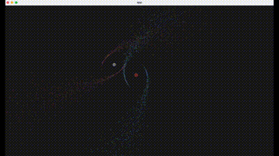

# Miniverse

[](./assets/showcase.mp4)

A library for simulating n-body gravity interactions, written in Rust using the Bevy game engine.

This project looks to provide an easy to use gravity simulation.

## Getting started

```
cargo new my_universe
cd my_universe
```

Add miniverse as a dependency in your `cargo.toml`.

```
miniverse = "0.1.0"
```

In your main file write out the [galaxy](./src/bin/single_galaxy.rs) example:

```
extern crate miniverse;
use miniverse::{colors, Galaxy, Simulation, Vec3};

const TIME_STEP: f32 = 1.0 / 60.0;
const G: f32 = 10.0;
const PARTICLE_RADIUS: f32 = 0.05;
const CAMERA_SPEED: f32 = 20.0;
const CAMERA_DIST: f32 = -75.0;

fn main() {
    let mut sim = Simulation::new(
        TIME_STEP,
        G,
        PARTICLE_RADIUS,
        CAMERA_SPEED,
        CAMERA_DIST,
        colors::gray_dark,
    );

    let systems = vec![Galaxy {
        amount: 5000,
        arms: 3,
        center_mass: 5.0,
        center_pos: Vec3::new(0.0, 0.0, 0.0),
        center_vel: Vec3::new(0.0, 0.0, 0.0),
        normal: Vec3::new(0.0, 0.0, 1.0),
        particle_color: colors::blue,
        center_color: colors::gray_light,
    }];
    sim.config(systems);
    sim.run();
}
```

Build and run! Preferably build in release mode for smoother simulations.

```
cargo build --release
cargo run --release
```

### Next steps

Get familiarized with the API :)

## API

The idea is that pre-defined systems (called Prefabs) are simply inserted into the simulation, and then run together.
There are 4 types of systems so far:

- Particle
- Body
- Galaxy
- Asteroid Belt

Following the example above, when declaring the `systems` vec, simply insert your Prefabs:

```
let systems = vec![
        Body {
            mass: 10.0,
            radius: 5.0,
            color: colors::yellow,
            initial_position: Vec3::new(0.0, 0.0, 0.0),
            initial_velocity: Vec3::new(0.0, 0.0, 0.0),
        },
        AsteroidBelt {
            amount: 700,
            radius: 85.0,
            center_mass: 10.0,
            center_pos: Vec3::new(0.0, 0.0, 0.0),
            center_vel: Vec3::new(0.0, 0.0, 0.0),
            normal: Vec3::new(0.0, 0.0, 1.0),
            particle_color: colors::gray_light,
        },
    ];
```

Check out the our [examples](./src/bin/).
Also check out the documentation.

## Notes on the code

### Particle optimization

Particles are taken as massless, since their values are neglible compared to larger objects. This really helps out in optimizing the code using Bevy's ECS for gravity interaction calculation.

### Algorithm

Velocity verlet algorithm used applied to gravitational differential equations.

Initial algorithm used, was already coded into Bevy's examples.

### Galaxy generation

The code for galaxy generation (the spirals), was used from [this amazing repo](https://github.com/timokoesters/nbodysim).

## Future improvements

- Muli-threaded computations
- Integration methods
- Camera rotations
- Better documentation
